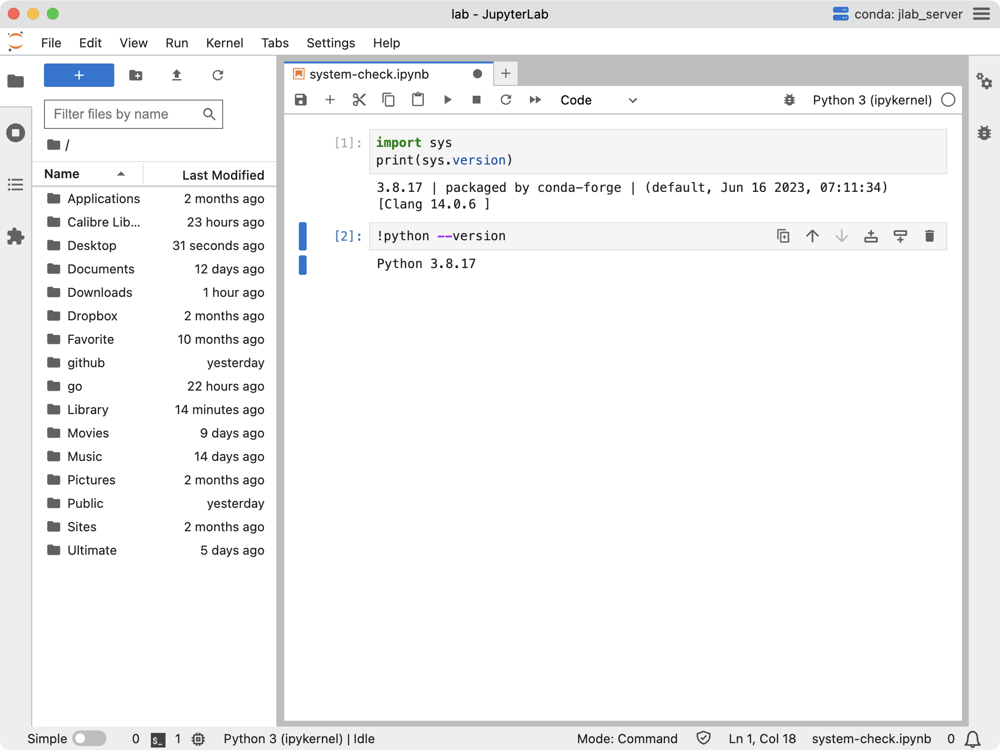
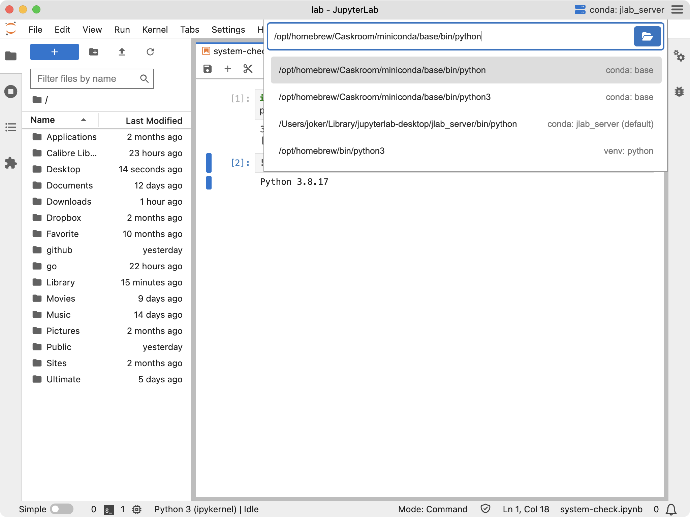
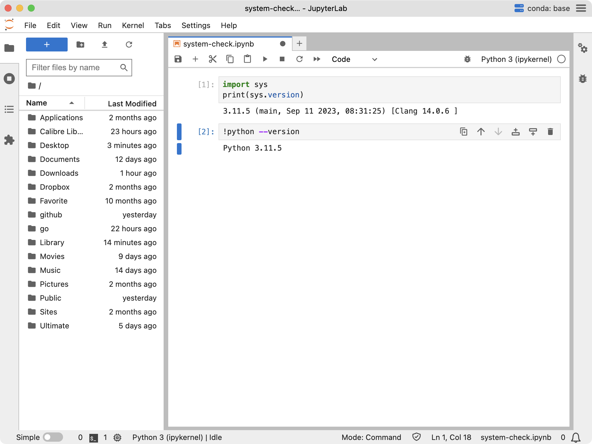
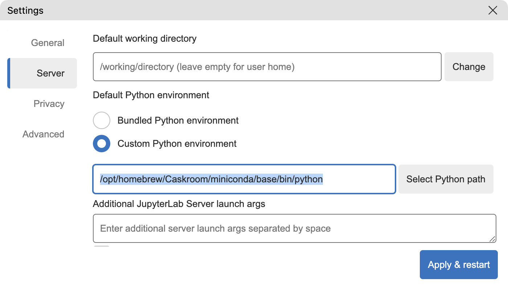

## 在本地安装 Jupyter 以及 JupyterLab-Desktop（MacOS）

macOS 系统自带的 Python 版本是 2.7，路径（path）通常是 `/usr/local/bin/python`；想要使用更高版本的 Python，必须自己动手安装。

## 1. 安装 Homebrew

先在 Terminal 里安装 `Homebrew`，以便将来用 `brew` 命令安装更多的软件：

```bash
/bin/bash -c "$(curl -fsSL https://raw.githubusercontent.com/Homebrew/install/HEAD/install.sh)"
```

## 2. 安装 Miniconda

随后，就去可以用 `brew` 安装 Miniconda 了，它是一个小型的 Python 管理工具。

```bash
brew install miniconda
```

安装完成之后，还要在 Terminal 执行以下命令：

```bash
conda init "$(basename "${SHELL}")"
```

这一步很重要，这个命令会更改一些必要的系统文件，以便 `conda` 能够正常使用。在我的机器上，以上的命令更改了我的 `~/.zshrc` 文件，添加了以下内容（你也可以手动添加）：

```bash
# conda init "$(basename "${SHELL}")"
# >>> conda initialize >>>
# !! Contents within this block are managed by 'conda init' !!
__conda_setup="$('/opt/homebrew/Caskroom/miniconda/base/bin/conda' 'shell.zsh' 'hook' 2> /dev/null)"
if [ $? -eq 0 ]; then
    eval "$__conda_setup"
else
    if [ -f "/opt/homebrew/Caskroom/miniconda/base/etc/profile.d/conda.sh" ]; then
        . "/opt/homebrew/Caskroom/miniconda/base/etc/profile.d/conda.sh"
    else
        export PATH="/opt/homebrew/Caskroom/miniconda/base/bin:$PATH"
    fi
fi
unset __conda_setup
# <<< conda initialize <<<
```

随后，可以检查一下当前的 `conda` 状态：

```bash
which conda
conda --version
```

## 3. 确认 Python 版本

```bash
which -a python
# 应该可以看到至少两个 Python 的位置
# 将来用 JupyterLab-Desktop 安装的 Python 版本（目前默认是 v3.8.17）不会被检索到
# ~/Library/jupyterlab-desktop/jlab_server/bin/python
python --version
# 应该给出的是 Miniconda 安装的版本，比如，Python 3.11.5
```

在一台机器上，可以安装很多个 Python 版本，本质上来看，只不过是 “把某个版本及其相关的组件都放到同一个 ‘文件夹’（或者 ‘目录’）之下”，而后，处于该目录下的 ptyhon 解释器会调用该目录下的各种组件。

例如，`/opt/homebrew/Caskroom/miniconda/base/bin/python` 这个 python 解释器，调用的就是 `/opt/homebrew/Caskroom/miniconda/base/` 这个目录下的 Python 组件，而这个 “环境” 的名称就是 `base`，可以用 `conda activate base` 启用。

## 4. 安装 Jupyterlab Module

```bash
python -m pip install jupyterlab 
```

## 5. 安装 JupyterLab-Desktop

```bash
brew install --cask jupyterlab
```

在 macOS 上，由于系统权限设置，Jupyterlab-Desktop 自带的命令行工具 `jlab` 需要手动安装：

```bash
sudo chmod 755 /Applications/JupyterLab.app/Contents/Resources/app/jlab
sudo ln -s /Applications/JupyterLab.app/Contents/Resources/app/jlab /usr/local/bin/jlab
```

可以选择使用 Jupyterlab-Desktop 自带的 “Bundled Python environment”，不过，它的 Python 版本是 3.8.17。这个 “Bundle” 中，Python 解释器是 `~/Library/jupyterlab-desktop/jlab_server/bin/python`；所有相关组件安装在 `~/Library/jupyterlab-desktop/jlab_server/` 文件夹之内。



想要使用更高版本的 Python 及其环境，比如，Python 3.11.5，就得用我们自己在系统上使用 `conda` 安装的 Python 环境。

打开 JupyterLab-Desktop 之后，右上角会显示当前使用的 Python 环境名称，比如，最初的时候，默认是 `conda: jlab_server`…… 点击这个字符串，会跳出一个带有输入框的下拉菜单：



在输入框里输入我们用 `conda` 安装的 Python 路径而后按 `Enter` 键即可：

```bash
# 用以下命令获取当前系统默认 Python 的路径：
which python
# 输出是：/opt/homebrew/Caskroom/miniconda/base/bin/python
# 把 "/opt/homebrew/Caskroom/miniconda/base/bin/python" 拷贝粘贴到输入框里
```

而后我们就可以在 JupyterLab-Destop 里面使用自己选择的 Python 版本了：



有必要的话，可以在 JupyterLab-Desktop 的 `Settings > Server` 对话框里，把某个 Python 环境设置成 “默认”：



## 6. jlab 命令使用

在 Terminal 里，使用以下命令 “以当前路径为工作路径打开 JupyterLab Desktop”（注意末尾的 `&`）：

```bash
jlab . &
```

如果忽略了末尾的 `&`，那么在使用 JupyterLab-Desktop 的时候，Terminal 就得一直打开着。

使用以下命令 “用 JupyterLab Desktop 打开某个 `.ipynb` 文件”，比如：

```bash
jlab sample.ipynb &
```

## 7. 使用 JupyterLab-Desktop 图形界面

当然，普通用户最适应的是 “图形界面”，JupyterLab-Desktop 的图形界面相对比较直观，很快就可以学会。最基础的，无非是几个最常用操作：

* `Shift+Enter`：执行某个单元格的代码；
* 连续按 `d` 两次：删除某个单元格；
* 指针拖拽：可以移动某个单元格，改变代码执行顺序；
* ……

## 8. 关于 Python 的基本使用

可以参照《[自学是门手艺](https://github.com/selfteaching/the-craft-of-selfteaching)》，也可以参照 [Python Cheatshee in Jupyter Notebookst](https://github.com/xiaolai/Python-Cheatsheets-in-Jupyter-Notebooks)。
